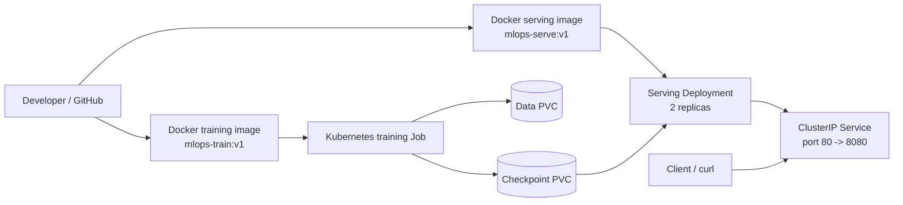

# mlops-pytorch-pipeline

This project implements an end-to-end MLOps pipeline for training and serving a CIFAR-10 image classifier using PyTorch, Docker, and Kubernetes.

The pipeline consists of:

* PyTorch model training
* Configurable training parameters
* CIFAR-10 dataset processing
* Persistent model checkpoints
* Dockerized training and inference
* Kubernetes training Job
* Kubernetes model-serving Deployment
* Kubernetes ClusterIP Service
* Health and readiness probes
* Optional Horizontal Pod Autoscaler (HPA)

---

## Project Structure

```text
mlops-pytorch-pipeline/
├── checkpoints/
│   └── classifier_v1.pt
├── configs/
│   └── training_config.yaml
├── data/
│   └── cifar-10-python.tar.gz
├── docker/
│   ├── Dockerfile.train
│   └── Dockerfile.serve
├── k8s/
│   ├── namespace.yaml
│   ├── configmap.yaml
│   ├── pvc.yaml
│   ├── training-job.yaml
│   ├── training-job-gpu.yaml
│   ├── serving-deployment.yaml
│   ├── serving-service.yaml
│   └── hpa.yaml
├── requirements/
│   ├── train.txt
│   └── serve.txt
├── src/
│   ├── dataset.py
│   ├── model.py
│   ├── train.py
│   └── serve.py
├── tests/
│   ├── test_k8s_manifests.py
│   ├── test_model.py
│   ├── test_serve.py
│   └── test_train.py
├── test_image.png
├── .dockerignore
└── README.md
```

---

# Local Training

The project trains an image classifier on CIFAR-10.

Training parameters are stored in:

```text
configs/training_config.yaml
```

rather than being hard-coded in the Python training script.

The model supports:

* `simple_cnn`
* `cnn` (alias for `simple_cnn`)
* `resnet18`

The checkpoint stores the model state, optimizer state, architecture, number of classes, epoch, and validation metrics.

---

## Setup

Use Python 3.10 or newer.

Create and activate a virtual environment:

```bash
python3 -m venv .venv
source .venv/bin/activate
```

Install the pinned dependencies:

```bash
python -m pip install --upgrade pip
python -m pip install -r requirements/train.txt
python -m pip install -r requirements/serve.txt
python -m pip install pytest==8.2.2 httpx==0.27.0
```

---

## Run Tests

The tests use synthetic tensors for model and training-loop checks. They do not download CIFAR-10.

Run:

```bash
python -m pytest -q
```

Kubernetes manifest validation can also be run independently:

```bash
python -m pytest -q tests/test_k8s_manifests.py
```

---

# Run Training Locally

The first training run downloads CIFAR-10 into the configured data directory.

Run:

```bash
python src/train.py --config configs/training_config.yaml
```

The configuration can alternatively be selected using the `TRAINING_CONFIG` environment variable:

```bash
TRAINING_CONFIG=configs/training_config.yaml python src/train.py
```

Training emits one JSON object per line.

Example:

```json
{"epoch": 1, "train_loss": 1.2345, "train_accuracy": 0.4567, "val_loss": 1.0123, "val_accuracy": 0.6012}
{"event": "checkpoint_saved", "path": "checkpoints/classifier_v1.pt", "epoch": 1, "val_loss": 1.0123}
{"event": "training_complete", "best_val_loss": 1.0123, "checkpoint_path": "checkpoints/classifier_v1.pt", "epochs_completed": 10}
```

`train.py` automatically selects CUDA when available and otherwise uses CPU.

The checkpoint contains:

* model architecture
* number of classes
* model state dictionary
* optimizer state dictionary
* epoch
* validation loss
* validation accuracy

---

# Build and Run the Training Image

The training image uses a multi-stage Docker build and installs the pinned dependencies from:

```text
requirements/train.txt
```

The dataset and checkpoint directories are mounted at runtime and are therefore not stored in the image.

Build:

```bash
docker build -f docker/Dockerfile.train -t mlops-train:v1 .
```

Run:

```bash
docker run --rm \
  -v "$(pwd)/data:/app/data" \
  -v "$(pwd)/checkpoints:/app/checkpoints" \
  mlops-train:v1
```

The image reads:

```text
/app/configs/training_config.yaml
```

by default.

To use another configuration without rebuilding:

```bash
docker run --rm \
  -v "$(pwd)/configs:/app/configs:ro" \
  -v "$(pwd)/data:/app/data" \
  -v "$(pwd)/checkpoints:/app/checkpoints" \
  mlops-train:v1 \
  --config /app/configs/training_config.yaml
```

Training logs are written to the container's standard output and the best checkpoint is written to the mounted `checkpoints/` directory.

---

# Kubernetes Configuration

The Kubernetes resources are deployed in the `ml-training` namespace.

Create the namespace and ConfigMap:

```bash
kubectl apply -f k8s/namespace.yaml
kubectl apply -f k8s/configmap.yaml
```

The ConfigMap projects:

```text
training_config.yaml
```

into:

```text
/app/configs
```

The workloads use:

```text
/app/data
/app/checkpoints
```

for persistent runtime storage.

PVC definitions are provided in:

```text
k8s/pvc.yaml
```

The PVCs intentionally omit `storageClassName` so that the cluster's default StorageClass is used.

Check the available StorageClasses:

```bash
kubectl get storageclass
```

If the cluster does not have a default StorageClass, configure the appropriate `storageClassName` in `k8s/pvc.yaml` before creating the PVCs.

---

# Kubernetes Image Availability

This is important when using Minikube.

Kubernetes running inside Minikube does **not automatically use images stored in the host Docker daemon**.

Therefore, building:

```bash
docker build -f docker/Dockerfile.serve -t mlops-serve:v1 .
```

on the host does not necessarily make `mlops-serve:v1` available to the Minikube node.

This can result in:

```text
ImagePullBackOff
```

and errors such as:

```text
Failed to pull image "mlops-serve:v1":
pull access denied for mlops-serve
```

## Minikube

Use Minikube's Docker environment before building the images:

```bash
eval "$(minikube docker-env)"
```

Then build:

```bash
docker build -f docker/Dockerfile.train -t mlops-train:v1 .
docker build -f docker/Dockerfile.serve -t mlops-serve:v1 .
```

Verify that the images are available:

```bash
docker images | grep mlops-
minikube image ls | grep mlops-
```

Both images should be visible.

This is the recommended approach for this project when using Minikube.

## Alternative: Load an Existing Image

If the image was already built using the host Docker daemon, it can also be loaded into Minikube:

```bash
minikube image load mlops-train:v1
minikube image load mlops-serve:v1
```

Then verify:

```bash
minikube image ls | grep mlops-
```

## kind

For kind:

```bash
docker build -f docker/Dockerfile.train -t mlops-train:v1 .
docker build -f docker/Dockerfile.serve -t mlops-serve:v1 .

kind load docker-image mlops-train:v1
kind load docker-image mlops-serve:v1
```

## Remote Kubernetes Cluster

For a remote cluster, push both images to an accessible container registry:

```text
<registry>/mlops-train:v1
<registry>/mlops-serve:v1
```

Then replace the image names in the Kubernetes manifests with the fully qualified registry references.

---

# Run the Kubernetes Training Job

Apply resources in dependency order:

```bash
kubectl apply -f k8s/namespace.yaml
kubectl apply -f k8s/configmap.yaml
kubectl apply -f k8s/pvc.yaml
```

Verify the PVCs:

```bash
kubectl get pvc -n ml-training -o wide
```

Both PVCs should eventually show:

```text
STATUS: Bound
```

Apply the training Job:

```bash
kubectl apply -f k8s/training-job.yaml
```

Monitor:

```bash
kubectl get jobs,pods -n ml-training -o wide
```

Wait for completion:

```bash
kubectl wait \
  --for=condition=complete \
  job/cifar10-training-v1 \
  -n ml-training \
  --timeout=30m
```

Inspect the logs:

```bash
kubectl logs job/cifar10-training-v1 -n ml-training
```

Inspect the Job:

```bash
kubectl describe job/cifar10-training-v1 -n ml-training
```

The logs should contain:

```text
checkpoint_saved
```

and:

```text
training_complete
```

The checkpoint should be written to:

```text
/app/checkpoints/classifier_v1.pt
```

---

## Important Note About `kubectl wait`

`kubectl wait` is intended to wait for a condition that has not yet been observed.

If the Job has already completed, first check:

```bash
kubectl get jobs -n ml-training
```

For example:

```text
cifar10-training-v1   Complete   1/1
```

If it already shows `Complete`, there is no need to wait again.

Inspect the logs directly:

```bash
kubectl logs job/cifar10-training-v1 -n ml-training
```

If the Job needs to be rerun, delete it first:

```bash
kubectl delete job/cifar10-training-v1 \
  -n ml-training \
  --ignore-not-found
```

Then recreate it:

```bash
kubectl apply -f k8s/training-job.yaml
```

Kubernetes Job names cannot normally be recreated unchanged while the previous Job object still exists.

---

# Verify the Trained Checkpoint

Before deploying model serving, verify that the checkpoint exists.

Locally:

```bash
ls -lh checkpoints/classifier_v1.pt
```

The checkpoint is expected to contain:

```text
epoch
architecture
num_classes
model_state_dict
optimizer_state_dict
val_loss
val_accuracy
```

For example, inspect it with:

```bash
python - <<'PY'
import torch

path = "checkpoints/classifier_v1.pt"

checkpoint = torch.load(
    path,
    map_location="cpu",
    weights_only=False,
)

print("Checkpoint type:", type(checkpoint))
print("Checkpoint keys:", list(checkpoint.keys()))
print("Architecture:", checkpoint.get("architecture"))
print("Num classes:", checkpoint.get("num_classes"))
PY
```

Expected values for the current model are:

```text
Architecture: simple_cnn
Num classes: 10
```

The serving application expects the checkpoint at:

```text
/app/checkpoints/classifier_v1.pt
```

---

# Build and Run the Serving Image

The serving image:

* installs only inference dependencies
* runs as the non-root `appuser`
* listens on port `8080`
* loads the checkpoint during application startup
* exposes `/health`
* exposes `/predict`
* uses the checkpoint mounted at runtime

Build:

```bash
docker build -f docker/Dockerfile.serve -t mlops-serve:v1 .
```

Run:

```bash
docker run --rm \
  -p 8080:8080 \
  -v "$(pwd)/checkpoints:/app/checkpoints:ro" \
  mlops-serve:v1
```

In another terminal:

```bash
curl -i http://localhost:8080/health
```

Expected response:

```text
HTTP/1.1 200 OK
```

with:

```json
{
  "status": "ok",
  "model_loaded": true
}
```

Test prediction:

```bash
curl -X POST http://localhost:8080/predict \
  -F "image=@test_image.png"
```

The response contains:

* `predicted_class`
* ten class probabilities

The probabilities should sum approximately to `1.0`.

---

# Serving Health Check

The serving application loads the model during FastAPI startup.

If the checkpoint cannot be loaded, the application intentionally remains running so that `/health` can report the problem.

In that case:

```bash
curl -i http://localhost:8080/health
```

returns:

```text
HTTP/1.1 503 Service Unavailable
```

A `503` from `/health` therefore means:

```text
FastAPI is running
but the model was not loaded successfully.
```

Check the container logs:

```bash
docker logs <container-id>
```

Common causes include:

* checkpoint does not exist
* incorrect `MODEL_CHECKPOINT`
* incompatible checkpoint
* model architecture mismatch
* incorrect checkpoint mount
* PyTorch/model dependency mismatch

The expected checkpoint path is:

```text
/app/checkpoints/classifier_v1.pt
```

---

# Validate Model Loading Inside the Container

Before debugging Kubernetes, model loading can be tested directly inside the serving image.

Verify the checkpoint:

```bash
docker run --rm \
  -v "$(pwd)/checkpoints:/app/checkpoints:ro" \
  mlops-serve:v1 \
  python -c '
import torch

p="/app/checkpoints/classifier_v1.pt"
c=torch.load(p,map_location="cpu",weights_only=False)

print("Loaded:", type(c))
print("Architecture:", c["architecture"])
print("Classes:", c["num_classes"])
print("State keys:", len(c["model_state_dict"]))
'
```

Then test the actual serving model loader:

```bash
docker run --rm \
  -v "$(pwd)/checkpoints:/app/checkpoints:ro" \
  mlops-serve:v1 \
  python -c '
from src.serve import load_model

m=load_model()

print("MODEL LOADED:", type(m))
print("DEVICE:", next(m.parameters()).device)
'
```

Expected result:

```text
MODEL LOADED: <class 'src.model.SimpleCNN'>
DEVICE: cpu
```

This confirms that:

1. the checkpoint is readable,
2. the checkpoint architecture is correct,
3. the state dictionary matches the model,
4. the serving image can successfully load the model.

---

# Deploy the Kubernetes Serving Layer

The serving Deployment should be applied **after the training Job has completed and the checkpoint PVC contains the trained checkpoint**.

Apply:

```bash
kubectl apply -f k8s/serving-deployment.yaml
kubectl apply -f k8s/serving-service.yaml
```

Check rollout:

```bash
kubectl rollout status deployment/model-serving -n ml-training
```

Inspect resources:

```bash
kubectl get deployment,pods,svc -n ml-training -o wide
```

Inspect the Deployment:

```bash
kubectl describe deployment model-serving -n ml-training
```

Check Service endpoints:

```bash
kubectl get endpoints model-serving -n ml-training
```

Expected result:

* two serving replicas
* both pods ready
* Service created
* Service endpoints populated

The Deployment mounts the checkpoint PVC read-only:

```text
/app/checkpoints
```

and uses `/health` for liveness and readiness probes.

The Service is an internal `ClusterIP`:

```text
port 80 -> container port 8080
```

---

# Troubleshooting `ImagePullBackOff`

If:

```bash
kubectl get pods -n ml-training
```

shows:

```text
ImagePullBackOff
```

describe the pod:

```bash
kubectl describe pod <pod-name> -n ml-training
```

Look at the Events section.

If it contains:

```text
Failed to pull image "mlops-serve:v1"
```

then the Kubernetes node cannot access the image.

For Minikube, check:

```bash
minikube image ls | grep mlops-serve
```

If nothing is returned, build or load the image into Minikube:

```bash
eval "$(minikube docker-env)"

docker build \
  -f docker/Dockerfile.serve \
  -t mlops-serve:v1 .
```

Then verify:

```bash
minikube image ls | grep mlops-serve
```

After the image is available, recreate the Deployment:

```bash
kubectl rollout restart deployment/model-serving -n ml-training
```

or delete the failed pods:

```bash
kubectl delete pod \
  -l app.kubernetes.io/name=model-serving \
  -n ml-training
```

The Deployment will recreate them.

---

# Kubernetes Health and Prediction Validation

Port-forward the Service:

```bash
kubectl port-forward \
  svc/model-serving \
  8080:80 \
  -n ml-training
```

In another terminal:

```bash
curl -i http://localhost:8080/health
```

Expected:

```text
HTTP/1.1 200 OK
```

with:

```json
{"status":"ok","model_loaded":true}
```

Test prediction:

```bash
curl -X POST \
  http://localhost:8080/predict \
  -F "image=@test_image.png"
```

Expected response structure:

```json
{
  "predicted_class": 3,
  "probabilities": [
    0.001,
    0.002,
    0.004,
    0.850,
    0.010,
    0.020,
    0.030,
    0.040,
    0.020,
    0.023
  ]
}
```

The exact predicted class and probabilities depend on the trained model.

The important validation requirements are:

* HTTP `200` from `/health`
* `model_loaded: true`
* `predicted_class` between `0` and `9`
* exactly ten probabilities
* probabilities summing approximately to `1`

---

# Optional HPA

The Horizontal Pod Autoscaler requires Kubernetes Metrics Server.

Check whether the Metrics API is available:

```bash
kubectl get apiservice v1beta1.metrics.k8s.io
```

or:

```bash
kubectl get --raw "/apis/metrics.k8s.io/v1beta1"
```

Only apply the HPA when Metrics Server is available:

```bash
kubectl apply -f k8s/hpa.yaml
```

Check:

```bash
kubectl get hpa model-serving -n ml-training
```

The configured HPA targets:

```text
70% average CPU utilization
```

and scales:

```text
minimum: 2 replicas
maximum: 4 replicas
```

If Metrics Server is unavailable, skip the HPA commands and document that autoscaling could not be verified.

Do not claim that HPA/autoscaling was verified without Metrics Server evidence.

---

# Architecture



The workflow is:

```text
Training Image
      |
      v
Kubernetes Training Job
      |
      +------> Data PVC
      |
      +------> Checkpoint PVC
                    |
                    v
             Serving Deployment
                 2 replicas
                    |
                    v
             ClusterIP Service
                    |
                    v
                 Client
```

The training Job produces:

```text
classifier_v1.pt
```

The serving Deployment consumes the same checkpoint from the checkpoint PVC.

This separates:

* training
* model artifact storage
* model serving
* service exposure
* optional autoscaling

---

# End-to-End Validation

Run the following sequence from the repository root.

## 1. Record the Environment

```bash
git rev-parse HEAD

kubectl config current-context

kubectl version

kubectl get nodes -o wide

kubectl get storageclass
```

Confirm that the cluster has sufficient CPU and memory.

---

## 2. Prepare Minikube

For Minikube:

```bash
eval "$(minikube docker-env)"
```

Build both images:

```bash
docker build \
  -f docker/Dockerfile.train \
  -t mlops-train:v1 .

docker build \
  -f docker/Dockerfile.serve \
  -t mlops-serve:v1 .
```

Verify:

```bash
minikube image ls | grep mlops-
```

Both images should be available before applying the workloads.

---

## 3. Create Kubernetes Resources

```bash
kubectl apply -f k8s/namespace.yaml

kubectl apply -f k8s/configmap.yaml

kubectl apply -f k8s/pvc.yaml
```

Verify:

```bash
kubectl get pvc -n ml-training -o wide
```

Both PVCs should be:

```text
Bound
```

---

## 4. Run the Training Job

```bash
kubectl apply -f k8s/training-job.yaml
```

Monitor:

```bash
kubectl get jobs,pods -n ml-training -o wide
```

Wait:

```bash
kubectl wait \
  --for=condition=complete \
  job/cifar10-training-v1 \
  -n ml-training \
  --timeout=30m
```

Inspect logs:

```bash
kubectl logs \
  job/cifar10-training-v1 \
  -n ml-training
```

Verify:

```text
checkpoint_saved
```

and:

```text
training_complete
```

Inspect:

```bash
kubectl describe job \
  cifar10-training-v1 \
  -n ml-training
```

---

## 5. Verify the Checkpoint

If the checkpoint is available locally:

```bash
ls -lh checkpoints/classifier_v1.pt
```

Inspect its metadata:

```bash
python - <<'PY'
import torch

checkpoint = torch.load(
    "checkpoints/classifier_v1.pt",
    map_location="cpu",
    weights_only=False,
)

print("Architecture:", checkpoint["architecture"])
print("Num classes:", checkpoint["num_classes"])
print("State keys:", len(checkpoint["model_state_dict"]))
PY
```

Expected:

```text
Architecture: simple_cnn
Num classes: 10
```

---

## 6. Validate the Serving Image Locally

Build:

```bash
docker build \
  -f docker/Dockerfile.serve \
  -t mlops-serve:v1 .
```

Run:

```bash
docker run --rm \
  -p 8080:8080 \
  -v "$(pwd)/checkpoints:/app/checkpoints:ro" \
  mlops-serve:v1
```

In another terminal:

```bash
curl -i http://localhost:8080/health
```

Expected:

```text
HTTP/1.1 200 OK
```

Then:

```bash
curl -X POST \
  http://localhost:8080/predict \
  -F "image=@test_image.png"
```

This local test should pass before troubleshooting Kubernetes serving.

---

## 7. Deploy Kubernetes Serving

```bash
kubectl apply -f k8s/serving-deployment.yaml

kubectl apply -f k8s/serving-service.yaml
```

Check rollout:

```bash
kubectl rollout status \
  deployment/model-serving \
  -n ml-training
```

Check:

```bash
kubectl get deployment,pods,svc \
  -n ml-training \
  -o wide
```

Check endpoints:

```bash
kubectl get endpoints \
  model-serving \
  -n ml-training
```

Confirm:

* two replicas are running
* both replicas are Ready
* Service exists
* Service endpoints are populated

---

## 8. Test Kubernetes Serving

Start port forwarding:

```bash
kubectl port-forward \
  svc/model-serving \
  8080:80 \
  -n ml-training
```

Then:

```bash
curl -i http://localhost:8080/health
```

Expected:

```json
{"status":"ok","model_loaded":true}
```

Test prediction:

```bash
curl -X POST \
  http://localhost:8080/predict \
  -F "image=@test_image.png"
```

Verify:

* predicted class is between `0` and `9`
* ten probabilities are returned
* probabilities approximately sum to `1`

---

## 9. Verify HPA Only When Metrics Server Is Available

```bash
kubectl get --raw "/apis/metrics.k8s.io/v1beta1"
```

If available:

```bash
kubectl apply -f k8s/hpa.yaml

kubectl get hpa \
  model-serving \
  -n ml-training
```

If unavailable:

```text
Do not apply the HPA and do not claim that autoscaling was verified.
```

Document the Metrics Server limitation in the assignment evidence.

---

# Troubleshooting Summary

## Problem: `ImagePullBackOff`

Check:

```bash
kubectl describe pod <pod-name> -n ml-training
```

If the image cannot be pulled:

```bash
minikube image ls | grep mlops-serve
```

For Minikube:

```bash
eval "$(minikube docker-env)"
docker build -f docker/Dockerfile.serve -t mlops-serve:v1 .
```

---

## Problem: `/health` returns `503`

Check the serving logs:

```bash
kubectl logs <serving-pod> -n ml-training
```

The application is running, but model loading failed.

Verify:

```text
/app/checkpoints/classifier_v1.pt
```

is available through the mounted checkpoint PVC.

The local Docker test can isolate the problem:

```bash
docker run --rm \
  -v "$(pwd)/checkpoints:/app/checkpoints:ro" \
  mlops-serve:v1 \
  python -c 'from src.serve import load_model; m=load_model(); print(type(m))'
```

---

## Problem: `curl localhost:8080` returns connection refused

If the serving container is not currently running, port `8080` will not be available.

Start the container:

```bash
docker run --rm \
  -p 8080:8080 \
  -v "$(pwd)/checkpoints:/app/checkpoints:ro" \
  mlops-serve:v1
```

Then use another terminal for:

```bash
curl -i http://localhost:8080/health
```

For Kubernetes, make sure port forwarding is active:

```bash
kubectl port-forward \
  svc/model-serving \
  8080:80 \
  -n ml-training
```

---

## Problem: Kubernetes Deployment has zero available replicas

Check:

```bash
kubectl get pods -n ml-training
```

Then:

```bash
kubectl describe pod <pod-name> -n ml-training
```

Also check:

```bash
kubectl get events \
  -n ml-training \
  --sort-by=.lastTimestamp
```

Common causes include:

* image unavailable to the Kubernetes node
* checkpoint PVC not mounted
* checkpoint missing
* insufficient CPU or memory
* failed health/readiness probe

---

# Validation Checklist

Use the following checklist when collecting assignment evidence.

* [ ] CI check passes.
* [ ] Git commit SHA recorded.
* [ ] Kubernetes context recorded.
* [ ] Node information recorded.
* [ ] StorageClass information recorded.
* [ ] Both PVCs are `Bound`.
* [ ] Training image is available to the Kubernetes cluster.
* [ ] Serving image is available to the Kubernetes cluster.
* [ ] Training Job is `Complete`.
* [ ] Training logs show JSON metrics.
* [ ] Training logs show `checkpoint_saved`.
* [ ] Training logs show `training_complete`.
* [ ] `classifier_v1.pt` exists.
* [ ] Checkpoint contains `model_state_dict`.
* [ ] Checkpoint architecture is `simple_cnn`.
* [ ] Checkpoint contains 10 classes.
* [ ] Serving image starts successfully.
* [ ] Local `/health` returns HTTP 200.
* [ ] Local `/predict` returns a prediction.
* [ ] Kubernetes serving Deployment is running.
* [ ] Two serving replicas are Ready.
* [ ] Checkpoint PVC is mounted read-only by the serving Deployment.
* [ ] Service endpoints are populated.
* [ ] Kubernetes `/health` returns HTTP 200.
* [ ] Kubernetes `/predict` returns ten probabilities.
* [ ] HPA evidence is included if Metrics Server is available.
* [ ] Metrics Server limitation is documented if HPA cannot be verified.

---

# Important Lessons from the Deployment Workflow

### 1. Docker images are environment-specific

An image built in the host Docker daemon is not automatically available inside Minikube.

For Minikube, either build after:

```bash
eval "$(minikube docker-env)"
```

or explicitly load the image:

```bash
minikube image load mlops-serve:v1
```

### 2. Training completion and serving are separate stages

The serving Deployment should only be started after:

```text
Training Job
      ↓
Checkpoint created
      ↓
Checkpoint available through PVC
      ↓
Serving Deployment
```

### 3. `/health` validates model loading, not just process availability

A running Uvicorn process does not necessarily mean the model is usable.

The application intentionally returns:

```text
503
```

when the model checkpoint cannot be loaded.

A successful health response is therefore evidence that:

```text
FastAPI running
+
checkpoint accessible
+
model architecture compatible
+
state dictionary loaded
```

### 4. Test the serving container before Kubernetes

A useful debugging sequence is:

```text
Checkpoint validation
        ↓
Docker model-loading test
        ↓
Docker /health test
        ↓
Docker /predict test
        ↓
Kubernetes image availability
        ↓
Kubernetes Deployment
        ↓
Kubernetes Service
        ↓
Kubernetes /health
        ↓
Kubernetes /predict
```

This makes it much easier to determine whether a problem belongs to the model, Docker image, storage, or Kubernetes configuration.

---

# Final End-to-End Flow

```text
CIFAR-10
   |
   v
PyTorch Training
   |
   v
classifier_v1.pt
   |
   v
Checkpoint PVC
   |
   +----------------------+
   |                      |
   v                      v
Training Job          Serving Deployment
                          |
                     2 replicas
                          |
                          v
                   /app/checkpoints
                          |
                          v
                    FastAPI /health
                          |
                          v
                    FastAPI /predict
                          |
                          v
                    ClusterIP Service
                          |
                          v
                        Client
```

The optional HPA can scale the serving Deployment from two to four replicas when Kubernetes Metrics Server is available.
